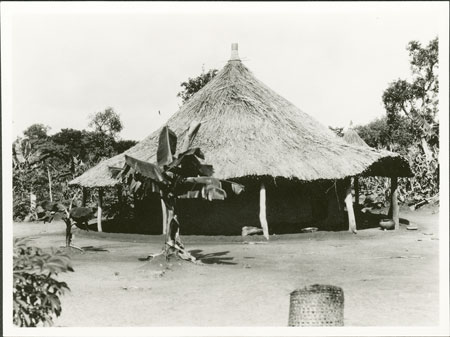
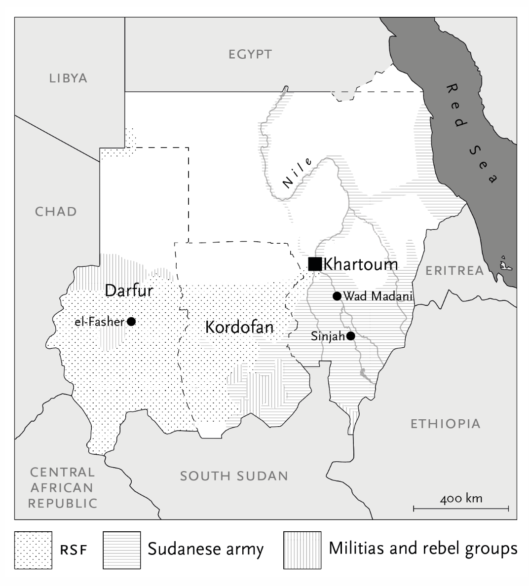
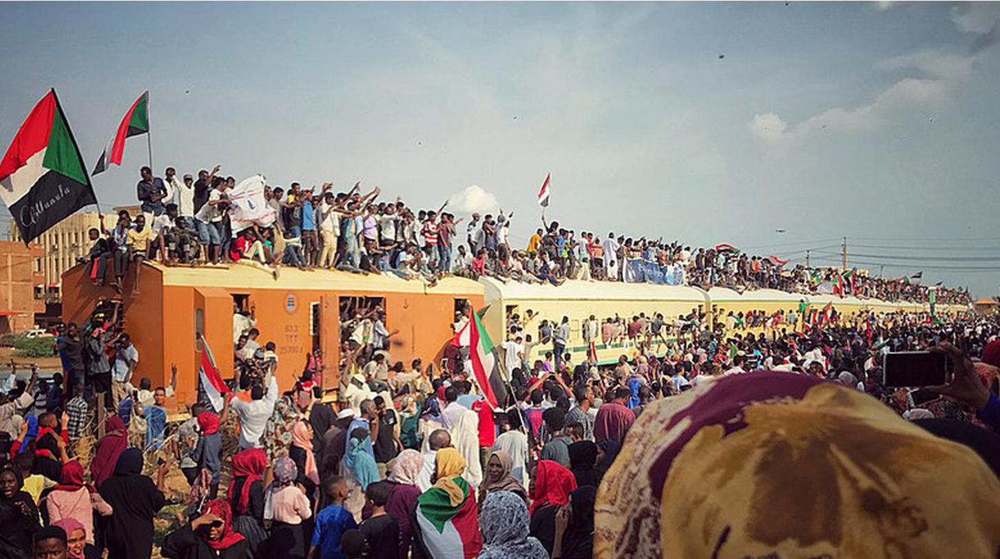
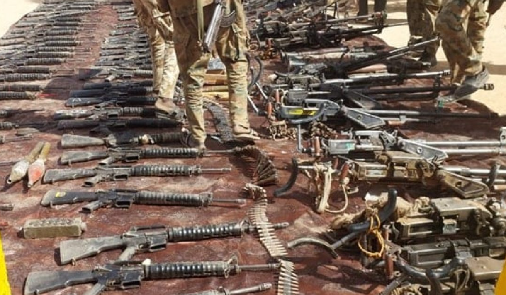
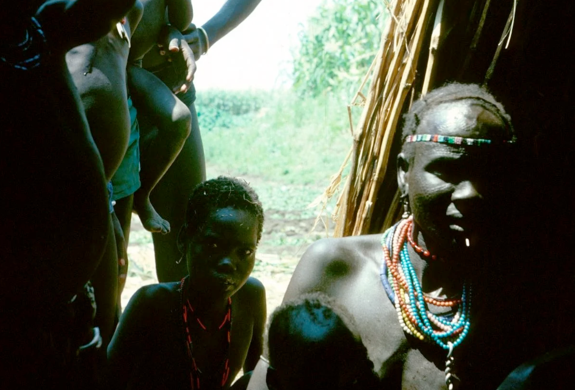

## Conflicto y gobierno {#inicio}

::: {.fragment .fade-up}
```{=html}
<p style="color:#999; font-size:0.9m; margin-bottom:1.2rem;">Seleccioná un material para explorar</p>
```
:::

::: {.fragment .fade-up}
```{=html}
<div class="btn-group">
  <a class="nav-btn" href="#/archivos">🗂️ Archivos</a>
  <a class="nav-btn" href="#/videos">🎬 Videos</a>
  <a class="nav-btn" href="#/articulos">📰 Artículos</a>
</div>
```
:::

---


## Archivos {#archivos .seccion}

::: {.fragment .fade-up}
```{=html}
<div class="btn-group">
  <a class="nav-btn" href="#/fotografias">📷 Fotografías de Evans-Pritchard</a>
</div>
<div class="btn-group">
  <a class="nav-btn-back" href="#/inicio">← Volver al inicio</a>
</div>
```
:::

---


## Fotografías Evans-Pritchard {#fotografia}

:::: {.columns}

::: {.column width="50%" .fragment .fade-left}
El Southern Sudan Project del Museo Pitt Rivers (Universidad de Oxford) digitalizó más de 2500 fotografías tomadas por Evans-Pritchard durante su trabajo de campo en Sudán entre 1926 y 1936.

Estas imágenes muestran escenas de la vida cotidiana de los Nuer, Azande y otros pueblos: ceremonias, viviendas, ganado y retratos.

```{=html}
<div style="margin-top:1.2rem;">
  <a class="nav-btn-back" href="#/archivos">← Volver a archivos</a>
</div>
```
:::

::: {.column width="50%" .fragment .fade-up}
{width="100%" style="object-fit:cover; border-radius:10px;"}

```{=html}
<a class="nav-btn" href="https://southernsudan.prm.ox.ac.uk/search/photographer/Pritchard/index.html" target="_blank" style="margin-top:0.8rem;">↗ Southern Sudan Project — Pitt Rivers Museum</a>
```
:::

::::

---

## Videos {#videos .seccion}

Selección de materiales audiovisuales para profundizar en los temas de la unidad a través de casos etnográficos.

::: {.fragment .fade-up}
```{=html}
<div class="btn-group" style="flex-direction: column; align-items: flex-start;">
  <a class="nav-btn" href="#/nuer">The Nuer</a>
  <a class="nav-btn" href="#/box">Box of Treasures</a>
  <a class="nav-btn-back" href="#/inicio">← Volver al inicio</a>
</div>
```
:::

---

## Film: Los Nuer {#nuer}

:::: {.columns}

::: {.column width="50%" .fragment .fade-up}
*The Nuer* (Hilary Harris & George Breidenbach, 1971)

The Nuer (1971), dirigido por Hilary Harris y George Breidenbach, es un documental etnográfico basado en los estudios de E. E. Evans-Pritchard. Retrata la vida del pueblo nuer en Sudán del Sur, mostrando su organización social y la centralidad del ganado en su cultura mediante un enfoque observacional.

```{=html}
<div style="margin-top:1.2rem;">
  <a class="nav-btn-back" href="#/videos">← Volver a videos</a>
</div>
```
:::

::: {.column width="50%" .fragment .fade-up}
```{=html}
<iframe width="100%" height="300"
  src="https://www.youtube.com/embed/Q_5-qUE3e8g?rel=0&modestbranding=1"
  title="The Nuer"
  frameborder="0"
  allow="accelerometer; autoplay; clipboard-write; encrypted-media; gyroscope; picture-in-picture; web-share"
  referrerpolicy="strict-origin-when-cross-origin"
  allowfullscreen
  style="border-radius:10px; display:block;">
</iframe>
```
:::

::::

---

## Box of Treasures {#box}

:::: {.columns}

::: {.column width="50%" .fragment .fade-up}
Video realizado por Chuck Olin en colaboración con el U'mista Cultural Centre.

A través del pueblo Kwakwaka'wakw, el material muestra cómo los objetos culturales —máscaras, esculturas y artefactos— funcionan como portadores de significados e identidades dentro de la comunidad.

```{=html}
<div style="margin-top:1.2rem;">
  <a class="nav-btn-back" href="#/videos">← Volver a videos</a>
</div>
```
:::

::: {.column width="50%" .fragment .fade-up}
```{=html}
<iframe width="100%" height="300"
  src="https://www.youtube.com/embed/LAti7TNOSaA?rel=0&modestbranding=1"
  title="Box of Treasures"
  frameborder="0"
  allow="accelerometer; autoplay; clipboard-write; encrypted-media; gyroscope; picture-in-picture; web-share"
  referrerpolicy="strict-origin-when-cross-origin"
  allowfullscreen
  style="border-radius:10px; display:block;">
</iframe>
```
:::

::::

---

## Artículos {#articulos .seccion}

En esta sección se reúnen artículos de actualidad sobre Sudán que abordan distintas dimensiones del conflicto y la coyuntura reciente. Los textos ofrecen miradas complementarias —políticas, geopolíticas y sociales— que permiten contextualizar la situación del país y comprender mejor sus dinámicas contemporáneas.

::: {.fragment .fade-up}
```{=html}
<div class="btn-group">
  <a class="nav-btn" href="#/art1">↗ Sudan's World War</a>
  <a class="nav-btn" href="#/art2">↗ Where Sudan</a>
  <a class="nav-btn" href="#/art3">↗ UAE's Subimperialism</a>
  <a class="nav-btn" href="#/nuerdilemmas">↗ Nuer Dilemmas</a>
  <a class="nav-btn-back" href="#/inicio">← Volver al inicio</a>
</div>
```
:::

---

## Sudan's World War {#art1}

:::: {.columns}

::: {.column width="50%" .fragment .fade-up}
“Sudan’s World War”, publicado en New Left Review, analiza el conflicto actual en Sudán como una guerra con implicancias regionales e internacionales. El artículo examina la disputa entre facciones militares y el papel de potencias extranjeras, mostrando cómo intereses geopolíticos y económicos amplían y complejizan el conflicto más allá de sus fronteras.

```{=html}
<div style="margin-top:1.2rem;">
  <a class="nav-btn-back" href="#/articulos">← Volver a artículos</a>
</div>
```
:::

::: {.column width="50%" .fragment .fade-up}
```{=html}
<a class="nav-btn" href="https://newleftreview.org/sidecar/posts/sudans-world-war" target="_blank">↗ Leer en New Left Review</a>
```

{width="100%" style="object-fit:cover; border-radius:10px;"}
:::

::::

---

## Where Sudan {#art2}

:::: {.columns}

::: {.column width="50%" .fragment .fade-up}
“Where Sudan…”, publicado en New Socialist, ofrece un recorrido histórico y político que sitúa a Sudán en el cruce de dinámicas regionales y globales. El artículo explora sus conflictos, recursos y posicionamiento geopolítico para entender cómo el país refleja y condensa procesos más amplios del sistema internacional.

```{=html}
<div style="margin-top:1.2rem;">
  <a class="nav-btn-back" href="#/articulos">← Volver a artículos</a>
</div>
```
:::

::: {.column width="50%" .fragment .fade-up}
```{=html}
<a class="nav-btn" href="https://www.newsocialist.org.uk/where-sudan-refracting-globe-through-bilad-al-dahab/" target="_blank">↗ Leer en New Socialist</a>
```
{width="100%" style="object-fit:cover; border-radius:10px;"}
:::

::::

---

## UAE's Subimperialism in Sudan {#art3}

:::: {.columns}

::: {.column width="50%" .fragment .fade-up}
“UAE’s Subimperialism in Sudan”, publicado en Spectre Journal, analiza el papel de Emiratos Árabes Unidos en el conflicto sudanés, destacando sus intereses económicos y estratégicos. El artículo muestra cómo su intervención influye en las dinámicas de poder internas y en la proyección regional del conflicto.

```{=html}
<div style="margin-top:1.2rem;">
  <a class="nav-btn-back" href="#/articulos">← Volver a artículos</a>
</div>
```
:::

::: {.column width="50%" .fragment .fade-up}
```{=html}
<a class="nav-btn" href="https://spectrejournal.com/uaes-subimperialism-in-sudan/" target="_blank">↗ Leer en Spectre</a>
```

{width="100%" style="object-fit:cover; border-radius:10px;"}
:::

::::

---

## Nuer Dilemmas {#nuerdilemmas}

:::: {.columns}

::: {.column width="50%" .fragment .fade-up}
Sharon Hutchinson creó un archivo para preservar el pasado, presente y futuro de las poblaciones del sur de Sudán.

El sitio reúne fotografías y audios de conversaciones en Sudán — complemento directo de su libro *Nuer Dilemmas*.

```{=html}
<div style="margin-top:1.2rem;">
  <a class="nav-btn-back" href="#/articulos">← Volver a artículos</a>
</div>
```
:::

::: {.column width="50%" .fragment .fade-up}
```{=html}
<a class="nav-btn" href="https://www.nuerdilemmas.com/project" target="_blank">↗ Ver archivo Nuer Dilemmas</a>
```

{width="100%" style="object-fit:cover; border-radius:10px;"}
:::

::::
